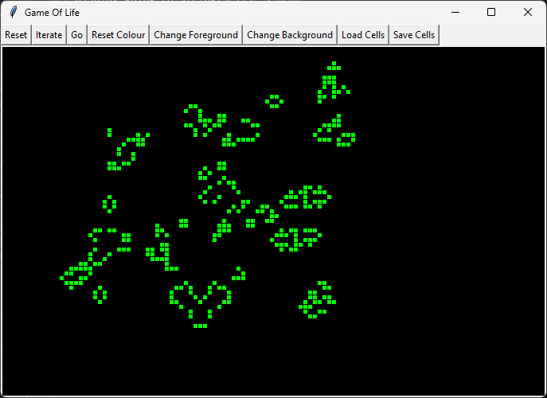

# PyGameOfLife

[](https://travis-ci.org/AaronRobson/PyGameOfLife)
[](https://circleci.com/gh/AaronRobson/PyGameOfLife)
[](https://coveralls.io/github/AaronRobson/PyGameOfLife?branch=master)

John Conway's Game Of Life implemented in the Python programming language.



# Install dependencies

## General

```sh
make install-packages
```

## Linux specific

```sh
sudo apt install -y python3-tk
```

(for Ubuntu and other Debian derived repositories)

## Windows

When installing python:
1. Select the _Add to Path_ option.
1. Include Tkinter bindings.

# Run linting and tests

```sh
make
```

## Run code checks

```sh
make check
```

### Run linting

Runs `flake8`.

```sh
make lint
```

### Run type checks

Runs `mypy`.

```sh
make typecheck
```

## Run tests

```sh
make test
```

Or:

```sh
make unittest
```

# Running

```sh
python3 gameoflifegui.py
```

(In Windows you may need to use `python` instead of `python3`)

aka:

```sh
make run
```
